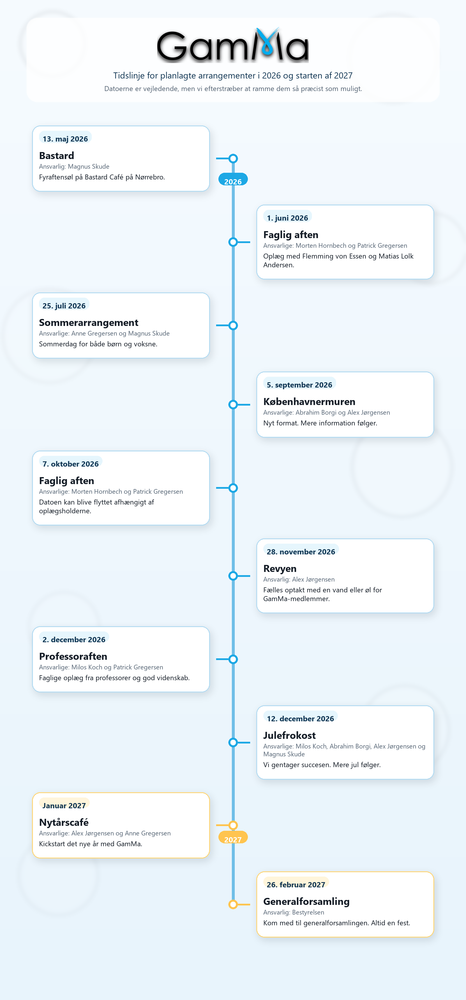

# Arrangementer 2026

Datoerne er vejledende, men vi efterstræber at ramme dem så præcist som muligt.

## 13. maj - Bastard

**Ansvarlig:** Magnus Skude

Vi gentager sidste års fyraftensøl på Bastard Café på Nørrebro, Borgmestervangen 21, 2200 København N.

Jeg booker borde, så vi har plads, og der er en gratis sodavand eller øl til hver person, der tilmelder sig som deltager.

Svar senest den 1. maj, så jeg er sikker på at kunne booke plads.

**Facebook:** [https://www.facebook.com/events/935100782602251](https://www.facebook.com/events/935100782602251)

## 1. juni - Faglig aften

**Ansvarlige:** Morten Hornbech og Patrick Gregersen

Så er det omsider blevet tid til endnu en faglig aften, hvor to færdiguddannede matematikere vil komme og fortælle om et emne, de brænder for.

Denne gang er der tale om ingen ringere end Flemming von Essen og Matias Lolk Andersen. Inden for et par uger kommer der mere information om deres oplæg her på siden.

Som sædvanlig vil GamMa stå for lidt mad og drikke til arrangementet, og derfor kræver det tilmelding. Vi glæder os til at se jer.

**Facebook:** [https://www.facebook.com/events/1352011586978094/](https://www.facebook.com/events/1352011586978094/)

## 25. juli - Sommerarrangement

**Ansvarlige:** Anne Gregersen og Magnus Skude

Igen i år holder vi et sommerarrangement, hvor alle er inviteret, både børn og voksne. Mere information følger.

## 5. september - Københavnermuren

**Ansvarlige:** Abrahim Borgi og Alex Jørgensen

I år prøver vi noget nyt. Mere information følger.

## 7. oktober - Faglig aften

**Ansvarlige:** Morten Hornbech og Patrick Gregersen

Arrangementet flyttes muligvis afhængigt af oplægsholderne. Mere information følger.

## 28. november - Revyen

**Ansvarlig:** Alex Jørgensen

Den årlige revy vender tilbage. Ligesom de seneste par år vil vi arrangere, at GamMa-medlemmer kan mødes inden forestillingen til en vand eller en øl.

## 2. december - Professoraften

**Ansvarlige:** Milos Koch og Patrick Gregersen

En faglig aften, men denne gang med oplæg fra professorer og god videnskab. Mere information følger.

## 12. december - Julefrokost

**Ansvarlige:** Milos Koch, Abrahim Borgi, Alex Jørgensen og Magnus Skude

Vi gentager succesen. Mere jul følger.

## Januar 2027 - Nytårscafé

**Ansvarlige:** Alex Jørgensen og Anne Gregersen

Kickstart det nye år med os. Mere information følger.

## 26. februar 2027 - Generalforsamling

**Ansvarlig:** Bestyrelsen

Kom med til generalforsamlingen. Altid en fest.
